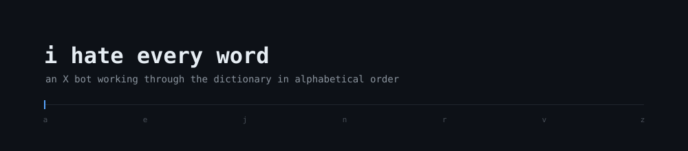

<p align="center">
  
</p>

<p align="center">
  <a href="https://x.com/hateeverywords"></a>
  <a href="https://github.com/mithianme/i-hate-every-word/actions/workflows/post.yml"></a>
  
  <a href="LICENSE"></a>
</p>

An X bot that posts every word in the English dictionary, in alphabetical order,
one word every 30 minutes.

```
i hate a
i hate aa
i hate aaa
i hate aah
```

The word list holds 370,105 entries. At the current interval, the account
finishes some time in 2047.

## How it works

`bot.py` reads the next unposted word from `words.txt`, publishes it through the
X API, then writes its new position to `state.txt`. The position is written only
after the API call succeeds, so the bot resumes on the correct word after a
crash, a reboot, or a manual stop. In the narrow case where a post succeeds but
the state write does not, the retry is rejected by X as a duplicate and the bot
advances rather than posting twice.

| File | Purpose |
| :--- | :--- |
| `words.txt` | Word list, alphabetical, 370,105 entries |
| `state.txt` | Current position — a single integer |
| `banned.txt` | Words the bot skips |
| `bot.py` | The bot |
| `.github/workflows/post.yml` | Scheduled execution via GitHub Actions |

`banned.txt` holds slurs and abuse terminology, skipped on a whole-word match.
Profanity is not filtered.

## Requirements

- Python 3.9 or later
- An X developer account, with an app configured for **Read and write**
- The app's four OAuth 1.0a credentials: API key, API key secret, access token,
  access token secret

> [!NOTE]
> The OAuth 2.0 client ID and client secret shown further down the same page are
> a different authentication flow, and will fail with a 401.

X bills the API per request. A text post costs $0.015, putting this cadence at
roughly $22 per month.

> [!WARNING]
> A post containing a URL costs $0.20 — over thirteen times more. Any change to
> the message format should avoid links. Set a spending cap in the developer
> console before running the bot unattended.

## Installation

```bash
git clone https://github.com/mithianme/i-hate-every-word.git
cd i-hate-every-word
pip install -r requirements.txt
cp keys.env.example keys.env
```

Add the four credentials to `keys.env`. The file is listed in `.gitignore` and
should not be committed.

## Usage

```bash
python bot.py           # post a single word and exit
python bot.py --loop    # post continuously on an interval
```

On Windows, `run.bat` installs dependencies and starts the bot in loop mode.
`LOOP_INTERVAL` and the message format are defined at the top of `bot.py`.

## Scheduled execution

`.github/workflows/post.yml` runs the bot on a cron schedule using GitHub
Actions, committing the updated position back to the repository. This removes
the need for a dedicated host.

Add the four credentials as repository secrets under **Settings → Secrets and
variables → Actions**, using the same names as `keys.env.example`. Two
operational notes:

- Public repositories receive unlimited Actions minutes; private repositories
  are metered.
- GitHub disables scheduled workflows after 60 days without human activity in
  the repository. Commits made by the workflow itself do not count.

## Licence

MIT
